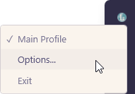
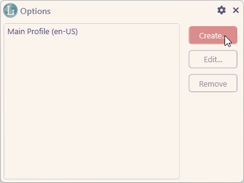
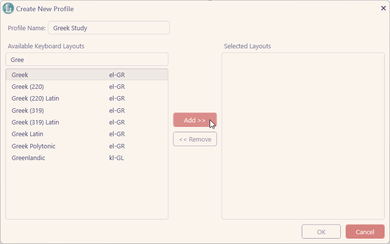
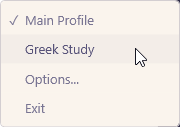



<h1 align="center">SwitchyLingus</h1>
<h3 align="center">Save keyboard layout setups and switch between them in one click</h3>

  
  

## Overview

SwitchyLingus is a lightweight Windows tool that lets you quickly switch between predefined sets of keyboard layouts.

It’s meant for language learners, translators, and anyone who regularly works with multiple languages but doesn’t want to constantly manage layouts manually.

## Why this exists

If you work with more than one language on Windows, setting up keyboard layouts can be annoying.

You add a language, then realize Windows gave you a layout you do not want. So you go into settings, remove it, and add the one you actually need.

SwitchyLingus makes that easier. It lets you save different keyboard layout setups as profiles and switch between them with one click.

## How it works

On first launch:

- The app scans your current keyboard layouts
- Creates a default profile based on your current setup

After that:

- You can create as many profiles as you want
- Each profile holds a set of layouts
- Switching profiles replaces your active layouts immediately

## How to use

Open SwitchyLingus from the system tray and click **Options...**

In the Options window, click **Create...**

Select the keyboard layouts you want for this profile

Once the profile is created, switch to it from the tray menu

That’s it. Create as many profiles as you need.

## License

[GPL-3.0](./LICENSE)
